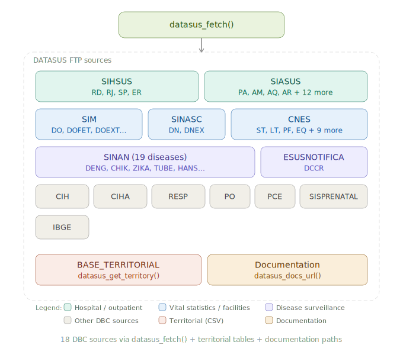

# datasusr 

<!-- badges: start -->
[](https://github.com/StrategicProjects/datasusr/actions/workflows/R-CMD-check.yaml)
<!-- badges: end -->


**datasusr** provides fast, in-memory reading of DATASUS `.dbc` files and a
complete workflow for discovering, downloading, caching, and reading Brazilian
public health data from the DATASUS FTP.

> **Looking for a broader toolkit?** If your workflow goes beyond the DATASUS
> FTP — e.g. you also need IBGE surveys (VIGITEL, PNS, PNAD-C, POF, Censo),
> SISAB primary-care indicators, ANS, ANVISA, or out-of-the-box variable
> dictionaries and value labels —
> [`healthbR`](https://github.com/SidneyBissoli/healthbR) is the more complete
> and currently more active package, and is the recommended first choice in
> many cases. `datasusr` focuses on being a small, fast, dependency-light
> reader for raw DBC files plus a catalog and FTP layer. See the
> [Comparison article](https://strategicprojects.github.io/datasusr/articles/comparison.html)
> for the full breakdown.

<table class="important-banner"><tr><td>
&#x2755;&#xFE0F; <strong class="important-title">Disclaimer</strong><br>
This package is an independent, community-maintained tool that accesses
publicly available data files from the DATASUS FTP server
(<code>ftp://ftp.datasus.gov.br</code>). It is <strong>not affiliated
with</strong> the Brazilian Ministry of Health, DATASUS, or any government
entity. To maintain consistency with R package development standards, all
functions use English names (e.g. <code>datasus_fetch()</code>,
<code>datasus_sources()</code>). However, because the source data is
produced by Brazilian government systems, <strong>parameter values</strong>
use official DATASUS codes in Portuguese (e.g.
<code>source = "SIHSUS"</code>, <code>uf = "PE"</code>), and
<strong>column names</strong> in the returned tibbles reflect the original
DBC/DBF field names (e.g. <code>uf_zi</code>, <code>ano_cmpt</code>,
<code>munic_res</code>, <code>val_tot</code>). For reference on the
original data layouts and field descriptions, use
<code>datasus_docs_url()</code> or see the
<a href="https://datasus.saude.gov.br">official DATASUS documentation</a>.
</td></tr></table>


## Installation

```r
# Install from GitHub
# install.packages("remotes")
remotes::install_github("StrategicProjects/datasusr")
```

## Quick start

```r
library(datasusr)

# One-step: list, download, and read SIH data for Pernambuco
df <- datasus_fetch(
  source    = "SIHSUS",
  file_type = "RD",
  year      = 2024,
  month     = 1,
  uf        = "PE"
)

df
```

## Step-by-step workflow

For more control, use the individual functions:

```r
library(datasusr)

# 1. Explore the catalog
datasus_sources()
datasus_file_types(source = "SIHSUS")

# 2. List available files on the FTP
files <- datasus_list_files(
  source    = "SIHSUS",
  file_type = "RD",
  year      = 2024,
  month     = 1:3,
  uf        = c("PE", "PB")
)

# 3. Download (with automatic caching)
downloads <- datasus_download(files, use_cache = TRUE)

# 4. Read a DBC file into a tibble
x <- read_datasus_dbc(downloads$local_file[[1]])

# 5. Read with column selection and type control
x <- read_datasus_dbc(
  downloads$local_file[[1]],
  select     = c("uf_zi", "ano_cmpt", "dt_inter", "val_tot"),
  col_types  = c(dt_inter = "date", val_tot = "double"),
  parse_dates = TRUE
)
```

## Cache management

Downloads are cached by default so repeated runs do not hit the DATASUS FTP:

```r
datasus_cache_info()
datasus_cache_list()

# Prune old files
datasus_cache_prune(older_than_days = 90)

# Or clear everything
datasus_cache_clear()
```

You can configure the cache directory via the `DATASUSR_CACHE_DIR` environment
variable, the `datasusr.cache_dir` R option, or the `cache_dir` argument.

## Data sources

<p align="center">

</p>


## Main functions

| Function | Purpose |
|---|---|
| `datasus_fetch()` | List + download + read in one call |
| `read_datasus_dbc()` | Read `.dbc` / `.dbf` files into a tibble |
| `datasus_sources()` | Browse data sources in the catalog |
| `datasus_file_types()` | Browse file types by source |
| `datasus_list_files()` | List candidate files (optionally validated against FTP) |
| `datasus_download()` | Download files with caching support |
| `datasus_get_territory()` | Download territorial reference tables (municipalities, etc.) |
| `datasus_docs_url()` | Find FTP paths for documentation and data dictionaries |
| `datasus_ftp_ls()` | Raw FTP directory listing |
| `datasus_cache_*()` | Cache management helpers |

## Progress messages

All functions emit `cli` progress messages by default. Suppress them with
`verbose = FALSE`.

## License

MIT
